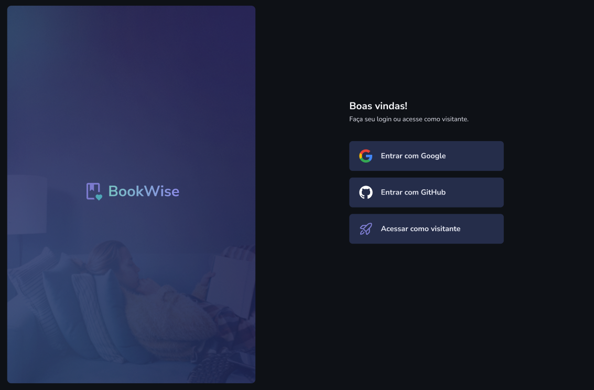

<h1 align="center"> Book Wise </h1>

# Resumo do projeto

Aplicação de consulta e avaliações de livros realizado em nextJS e NodeJS!

## 🔨 Funcionalidades do projeto

- `Funcionalidade 1` `Visualizar avaliações`: O usuário poderá visualizar todas as avaliações feitas por ele e por outros usuários, incluindo a data em que a avaliação foi feita, o nome e o autor do livro, o número da avaliação e o comentário.

- `Funcionalidade 2` `Visualizar todos os livros listados`: O usuário poderá visualizar todos os livros para que o usuário possa realizar uma avaliação.

- `Funcionalidade 3` `Visualizar todos os livros listados`: O usuário pode selecionar um livro para avaliar, escolhendo uma pontuação para ele e escrevendo um comentário sobre o livro.

- `Funcionalidade 3` `Visualizar e pesquisar todos as avaliações do usuário`: O usuário poderá visualizar todas as avaliações que ele realizou e também poderá pesquisar avaliações pelo nome do livro ou pelo autor.

## ✔️ Técnicas e tecnologias utilizadas

- `NextJS ⚛️`
- `Stiches 🎨`
- `Zod 🔐`
- `React-hook-form 📃`
- `Axios 🌐`
- `React-Toastify ⚠️`
- `NodeJS 🚀`
- `Prisma 💾`
- `Next-auth 🔒`
- `Next-SEO 📈`
- `Radix-ui 🎉`
- `Date-fns 📅`


## 📁 Acesso ao projeto

### Run

**Install dependencies**

```
npm install
```

**Run Dev**

```
npm run dev
```

Você pode acessar a aplicação clicando [aqui](https://bookwise-app.vercel.app).
